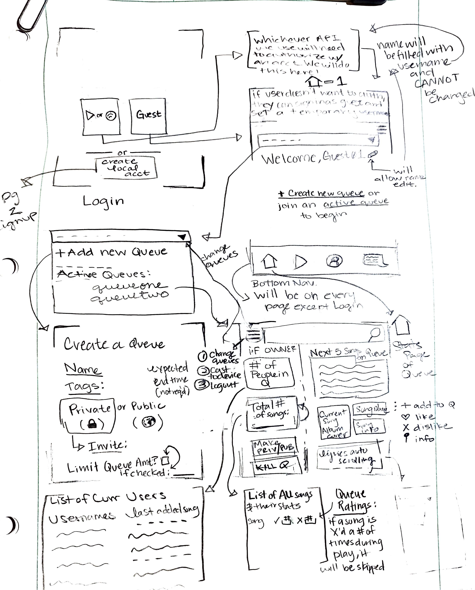
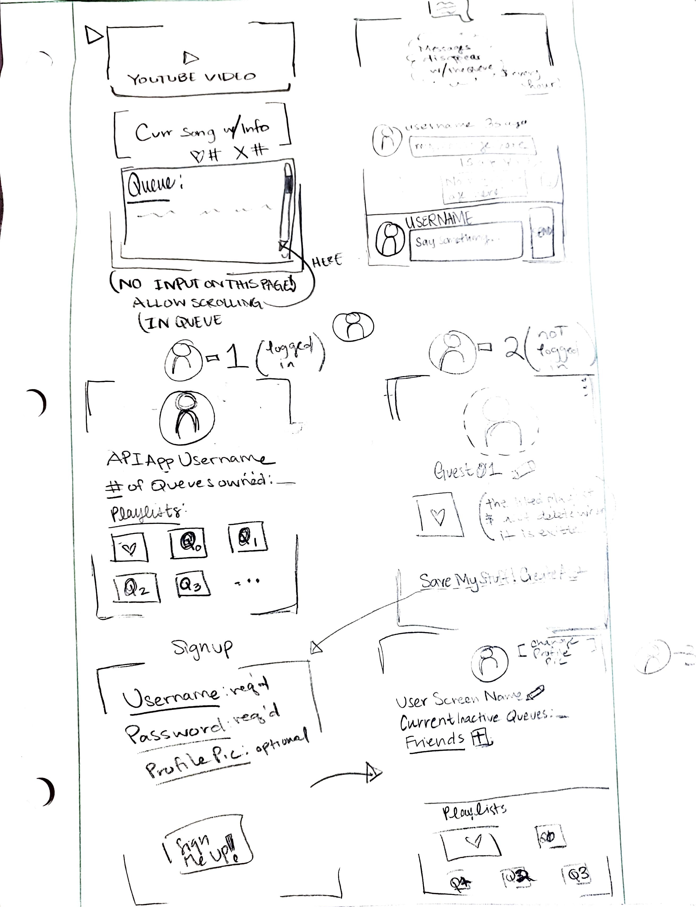
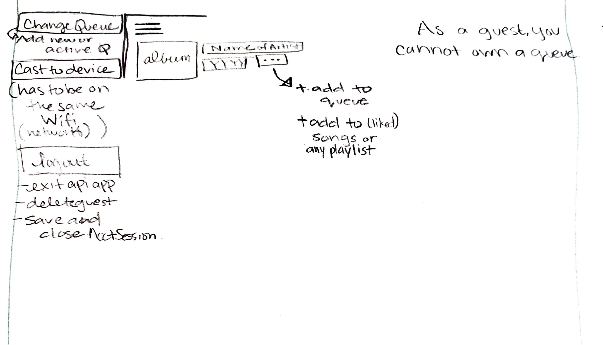

# cs480-queue-rhythm
===

## Table of Contents
1. [Overview](#Overview)
1. [Product Spec](#Product-Spec)
1. [Wireframes](#Wireframes)
2. [Schema](#Schema)

## Overview
### Description
QueueRhythm allows users to have shared music queues to share and listen to music together.Allows users to share and listen to music with others, while being able to collaborate on the music playlist.  

### App Evaluation
[Evaluation of your app acrohttps://www.youtube.com/watch?v=EZ9p4HZucvIss the following attributes]
- **Category:** Social / Music
- **Mobile:** This app will only be developed for mobile devices.
- **Story:** The user can search for music on Spotify, then add to playlist. The user then can invite others to contribute songs and listlen to the same playlist synchronously. 
- **Market:** This app will be available to everyone. Users looking to be able to share/collaborate with multiple users in the same queue.The use of tags and public/private options gives the user the ability to make queues to listen with others relevant to any everyday situation. 
- **Habit:*https://hackmd.io/QHm9aejkTt-wpBoyZwd1OQ*
Users can use QueueRhythm in small groups or by themselves. The private option allows users to have control over who can share and listen to the queue playlist.  
- **Scope:** The more rudimentary features will be allowing users to search for music on Spotify, then add songs to a collaborative playlist and invite others to join by sending an access code via text message.If user base grows large enought more advanced features could be implemented.Things like public playlist and chat boxes. The public playlist option allows users to collaborate with any user with the app, giving the opportunity to listen to music you have never heard of!

## Product Spec

### 1. User Stories (Required and Optional)

**Required Must-have Stories**

* User can access current playlist and mediaplayer/home-screen

* User seraches music on spotify then adds to playlist.

* User invites others to contribute songs and listlen to the same playlist.

**Optional Nice-to-have Stories**

* User can customize profile.

* User can set queue to public so it does not requir session ID.

* User can join a chat room and comunicate with others in the queue.

* User can create a Favorites playlistthat saves favorited songs to a list, allowing them to be auto-added to your current queue

* Profile Page - Allows user to personalize their page

* Public Queues - Make queues accessible without session ID

* Chat Room - Each queue comes with its own chat room

* Favorites List/Auto-add - Saves favorited songs to a list, allowing them to be auto-added to your current queue

### 2. Screen Archetypes

* Login / Register 
   * User signs up or logs into their account
* Media Players/main queue screen
   *  Allows the control of media playback
   *  Allows user to create or join queues
* Create QueueAnalyzes users music choices, and connects them to other users with similar choices. The user can then decide to message this person and befriend them if wanted.
   *  Allows user to create a queue: create queue name
   *  Creating a queue generates a session ID, allowing user to invite others to queue.
   *  Creating a queue adds to active queue list
* Change Queue 
   *  User can navigate the list of queues that have been created or queues that have been joined using session ID.

* Invite
   *  User can invite others in their contacts to join a queue using a session ID.

* Settings Page
   *  Allows user to log out and change queue preferences(adding users, changing queue name, deleting queue).

* Search Music
   *  User can search music to add to queue

* Detail Page
   *  User can see the list of music on queue
   *  User can see a frame of current song info(video or album cover, Song Title, Artist, and current position in song.

* Edit Page
   *  User can edit queue information
   *  User can delete queue
   
### 3. Navigation

**Tab Navigation** (Tab to Screen)

* Queue Changer
* Media Playback
* Profile
* Chat Room (Optional)
* Settings 

**Flow Navigation** (Screen to Screen)

* Login / Register 
   * Home
   * Signup Page
   * Join Queue Page (signing in as guest)
* Media Players/main queue screen(Home)
   *  Create Queue
   *  Join Queue
   *  Settings
   
* Create Queue
   *  Home 
* Change Queue 
   *  Home
* Invite
   *  Home

* Settings Page
   *  Login Page
   *  Edit Queue

* Search Music
   *  Home

* Detail Page
   *  Edit Page 
   *  Invite
   *  Settings
   *  Search Music
 
* Edit Page
   *  Home 

## Wireframes

 &nbsp;
 &nbsp;
  

### [BONUS] Digital Wireframes & Mockups

 &nbsp;
 &nbsp;
 &nbsp;
  

### [BONUS] Interactive Prototype

## Schema 
[This section will be completed in Unit 9]
### Models
[Add table of models]
### Networking
- [Add list of network requests by screen ]
- [Create basic snippets for each Parse network request]
- [OPTIONAL: List endpoints if using existing API such as Yelp]
### Additional Github Repos in dependencies
- https://github.com/spotify/android-sdk
